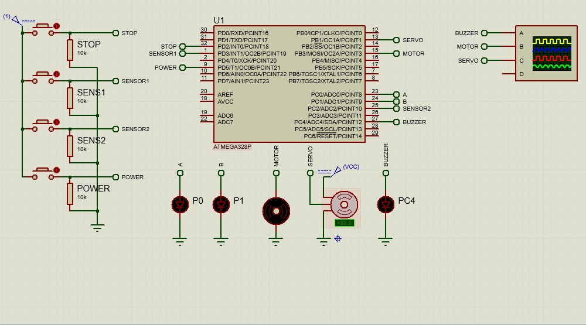

# Laboratorio 1 Microprocesadores Universidad Autonoma de Occidente Santiago de Cali, 2021

---

## Integrantes

- Ivan Camilo Holguin Perdomo
- Miguel Steven Rondon Salazar

## Resumen

Se realizo una aplicación a simulada de un proceso de producción de un tanque de mezclade los ingredientes A y B, mediante un microprocesador ATMEGA328P

